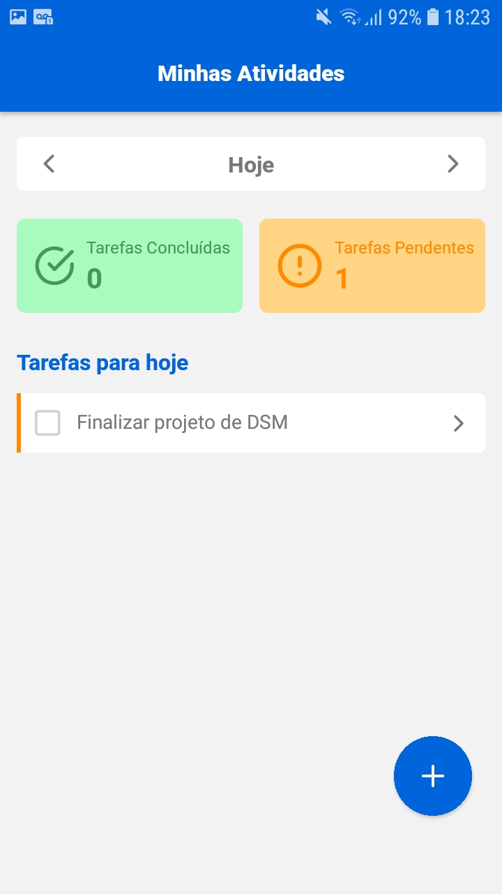

# Trabalho II - Desenvolvimento de Software para Dispositivos Móveis

A aplicação é uma app de gerência de tarefas desenvolvida com React Native, a qual possui uma integração com o firebase que permite persistir dados em um banco de dados não relacional de modo que 
os dados fiquem disponíveis em qualquer dispositivo que o usuário faça login. Além disso, utilizei o redux para fazer o gerenciamento de estado da aplicação para que fosse possível ter um estado global
que me permitisse compartilhar dados do usuário logado na aplicação e dados das tarefas cadastradas. A autenticação foi feita usando apenas um usuário fixo de modo que só é possível acessar as tarefas
ao fazer login com esse usuário. Além disso, é importante ressaltar que todos os dados inseridos pelos usuário são válidados para garantir a consistência das informações manipuladas no app.

## Dados de Acesso: 
- E-mail: joao@email.com
- Senha: joao1234

## Telas do App:

  &nbsp;&nbsp;&nbsp;&nbsp;&nbsp;&nbsp;&nbsp;&nbsp;&nbsp;
  &nbsp;&nbsp;&nbsp;&nbsp;&nbsp;&nbsp;&nbsp;&nbsp;&nbsp;
  &nbsp;&nbsp;&nbsp;&nbsp;&nbsp;&nbsp;&nbsp;&nbsp;&nbsp;
  &nbsp;&nbsp;&nbsp;&nbsp;&nbsp;&nbsp;&nbsp;&nbsp;&nbsp;

## Preview:

## Funcionalidades:

- Sistema de autenticação com usuário fixo
- Listagem de tarefas por dada
- Cadastro de tarefa
- Atualização de tarefa
- Remoção de tarefa
- Atualização de status da tarefa

## Tecnologias e bibliotecas utilizadas:

- Typescript
- React Native
- Firebase
- Redux
- React Native Vector Icons
- Yup
- React Navigation
